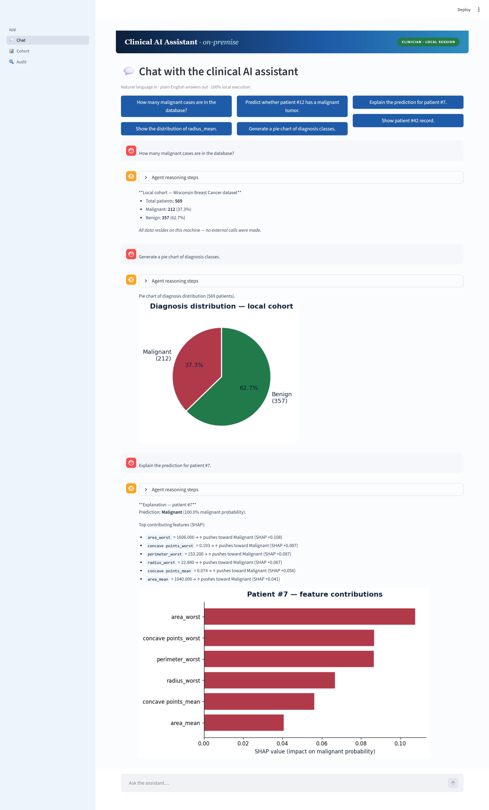

<div align="center">

# 🩺 Clinical AI Assistant · On-Premise

### A Secure Agentic Artificial Intelligence Framework for Privacy-Preserving Clinical Data Analysis & Decision Support


*Privacy-preserving clinical decision support — running entirely on a local workstation, with no cloud calls and no external data sharing.*

</div>

---

## 📺 Live Demonstration

<div align="center">
  
🎥 **Watch the video demonstration**

[](x1_Poster_Vidpresentation.mp4)

*Click the image to play the demo video.*

</div>

### 🖼️ Conversational Clinical Assistant — Live Screenshot

<div align="center">
  
</div>

---

## 📖 Overview

**Clinical AI Assistant · On-Premise** is a research prototype that demonstrates how clinicians can interact with local clinical datasets and predictive machine learning models using **natural language**, without ever sending data outside the hospital's infrastructure.

The system combines:

- 🗣️ **Conversational AI** powered by a local LLM (Llama 3.1 via Ollama)
- 🤖 **Agentic orchestration** with LangGraph for tool selection and reasoning
- 🧠 **Local machine learning inference** using scikit-learn
- 🔍 **Explainability** through SHAP feature contributions
- 🛡️ **Role-based access control** (Clinician · Researcher · Admin)
- 📝 **Immutable audit logging** of every action

> **Privacy by construction:** No external API calls. No cloud inference. No patient data leaves the local environment.

---

## ✨ Key Features

| Capability                            | Description                                                    |
| ------------------------------------- | -------------------------------------------------------------- |
| 💬 **Natural language interaction**   | Clinicians ask questions in plain English                       |
| 🧠 **Local predictive models**        | Logistic Regression + Random Forest (~97% accuracy)            |
| 🔬 **SHAP explainability**            | Feature-level reasoning for every prediction                   |
| 📊 **Visualizations on demand**       | Histograms, pie charts, scatter plots, distributions           |
| 🛡️ **RBAC enforcement**               | Permissions checked before every tool call                     |
| 📋 **Audit trail**                    | Every prompt and tool call logged with timestamps              |
| 🏠 **100% on-premise**                | No cloud calls, no external API requests                       |
| 🔒 **Privacy-preserving by design**   | Patient data never leaves the local environment                |

---

## 💡 Example Use Cases

The assistant can answer questions such as:

```text
🔹 "How many malignant cases are in the database?"
🔹 "Predict whether patient #12 has a malignant tumor."
🔹 "Explain the prediction for patient #7."
🔹 "Generate a pie chart of diagnosis classes."
🔹 "Show patient #42 record."
🔹 "Show the distribution of radius_mean."
```

For each query, the agent:

1. **Verifies** the user's role and permissions (RBAC gate)
2. **Plans** by selecting the most appropriate local tool
3. **Acts** by querying the SQLite database, running a `.pkl` model, computing SHAP values, or generating a chart
4. **Explains** the result in plain English
5. **Logs** the interaction in the immutable audit trail

---

## 🏗️ System Architecture

```
                    ┌───────────────────────────────────┐
                    │       Streamlit Frontend          │
                    │   Chat · Cohort · Audit views     │
                    └───────────────┬───────────────────┘
                                    │ REST (localhost:8000)
                    ┌───────────────▼───────────────────┐
                    │     Django REST API + RBAC        │
                    └───────────────┬───────────────────┘
                                    │
                    ┌───────────────▼───────────────────┐
                    │     LangGraph Agent Pipeline      │
                    │  rbac_gate → planner → tool →     │
                    │     summarize → audit             │
                    └───────────────┬───────────────────┘
                                    │
        ┌──────────────┬────────────┼────────────┬──────────────┐
        ▼              ▼            ▼            ▼              ▼
   ┌─────────┐   ┌─────────┐  ┌──────────┐  ┌──────────┐  ┌──────────┐
   │ SQLite  │   │  .pkl   │  │ Matplotlib│  │   SHAP   │  │  Ollama  │
   │ Patient │   │ Models  │  │  Charts   │  │ Explainer│  │  (Local) │
   │   DB    │   │         │  │           │  │          │  │          │
   └─────────┘   └─────────┘  └──────────┘  └──────────┘  └──────────┘
```

---

## 🛠️ Tech Stack

| Layer            | Technology                                  |
| ---------------- | ------------------------------------------- |
| **Backend**      | Django 5 · Django REST Framework            |
| **Database**     | SQLite (local, file-based)                  |
| **Agent**        | LangGraph · LangChain · Ollama (Llama 3.1)  |
| **ML**           | scikit-learn · joblib · NumPy · pandas      |
| **Explainability**| SHAP                                       |
| **Visualization**| Matplotlib · Seaborn                        |
| **Frontend**     | Streamlit                                   |

---

## 🚀 Quick Start

### Prerequisites

- **Python 3.10–3.13** ([download](https://www.python.org/downloads/))
- **Ollama** with Llama 3.1 8B ([download](https://ollama.com/download))

```bash
ollama pull llama3.1:8b
```

### Setup (one-time)

```bash
# Windows
setup.bat

# macOS / Linux
chmod +x setup.sh && ./setup.sh
```

This creates a virtual environment, installs dependencies, trains the ML models, and seeds the database.

### Launch

```bash
# Windows
run.bat

# macOS / Linux
./run.sh
```

The application opens at **http://localhost:8501**

### Demo Accounts

| Username     | Password         | Role        |
| ------------ | ---------------- | ----------- |
| `clinician`  | `clinician123`   | Clinician   |
| `researcher` | `researcher123`  | Researcher  |
| `admin`      | `admin123`       | Admin       |

---

## 🛡️ Role-Based Access Control

| Role             | Cohort stats  | Patient record   | Run prediction | Export             | Audit log |
| ---------------- | :-----------: | :--------------: | :------------: | :----------------: | :-------: |
| **Clinician**    | ✓ own ward    | ✓ assigned       | ✓              | ✗                  | ✗         |
| **Researcher**   | ✓ aggregated  | ✗ identifiable   | ✓              | ✓ pseudonymised    | ✗         |
| **Admin**        | logs only     | logs only        | ✗              | ✓ audit trail      | ✓         |

---

## 📁 Project Structure

```
agentic-clinical-ai/
├── data/                    # Wisconsin Breast Cancer dataset
├── ml/                      # ML training pipeline + saved models
├── backend/                 # Django API + LangGraph agent
│   └── api/
│       ├── agent/           # State machine + tools
│       ├── permissions.py   # RBAC matrix
│       └── models.py        # Patient, AuditLog, UserProfile
└── frontend/                # Streamlit UI
    ├── app.py               # Login + landing
    └── pages/               # Chat · Cohort · Audit
```

---

## 🔗 Author & Contact

**Jonathan Katende Pinto** — PhD Student
Unit of Biostatistics, Epidemiology and Public Health (UBEP)
Department of Cardiac, Thoracic, Vascular Sciences and Public Health
University of Padova, Italy

📧 jonathankatende.pinto@studenti.unipd.it

<p align="center">
  <a href="https://www.linkedin.com/in/pinto-katende/">
    
  </a>
  <br>
  <a href="https://www.linkedin.com/in/pinto-katende/">
    
  </a>
</p>

---

## 📜 Citation

If you reference this work, please cite:

```bibtex
@inproceedings{pinto2026agentic,
  title  = {A Secure Agentic Artificial Intelligence Framework for
            Privacy-Preserving Clinical Data Analysis and Decision Support},
  author = {Pinto, Jonathan Katende and Lorenzoni, Giulia and Gregori, Dario},
  year   = {2026},
  booktitle = {3rd "Science and Us" — Biomedicine \& Health PhD Students
               Congress, University of Rijeka},
  address = {Rijeka, Croatia},
  month  = {May}
}
```

---

## ⚠️ Disclaimer

This is a **research prototype** developed for educational and demonstration purposes. It is **not a medical device** and **has not been validated for clinical use**. Any clinical decision must remain the responsibility of qualified medical professionals.

---

<div align="center">

*Built as a proof-of-concept for the on-premise agentic AI framework presented at the 3rd "Science and Us" Biomedicine & Health PhD Students Congress · University of Rijeka, 14–16 May 2026.*

</div>
```
---
